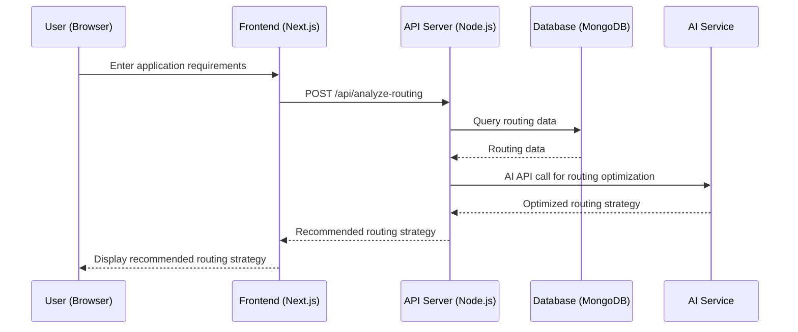
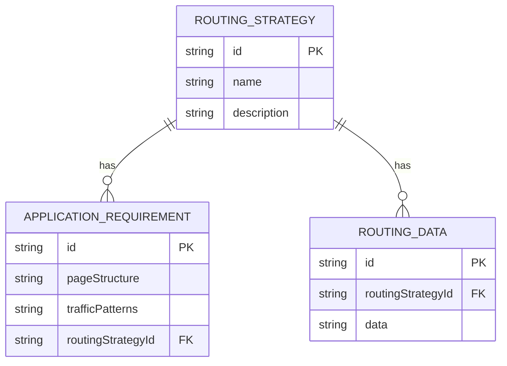

# Next.js Routing Analyzer
### MVP Architecture Document
> **Team:** talha · **Duration:** 12 weeks · **Stack:** Next.js, React

---

## 1. Executive Summary
The Next.js Routing Analyzer is a tool designed to help developers optimize their Next.js routing. It provides a user-friendly interface for inputting application requirements and outputs a recommendation for the most suitable routing strategy. The tool will be built using Next.js and will utilize a knowledge base of routing best practices to provide recommendations. The tool will also include features such as a routing simulation engine and a performance benchmarking tool.

The Next.js Routing Analyzer solves the problem of determining which type of routing to use and how to optimize it for a particular application. It delivers value by providing developers with a clear understanding of their routing options and how to improve the performance of their application.

The end-user experience will involve inputting application requirements, such as page structure and traffic patterns, and receiving a recommendation for the most suitable routing strategy. The tool will also provide a simulation environment for testing different routing scenarios and a benchmarking tool for measuring performance.

## 2. System Architecture Overview

### 2.1 High-Level Architecture Diagram
```
┌─────────────────────────────────┐
│         Next.js (Client)      │
└────────────┬────────────────────┘
             │ HTTPS / REST
┌────────────▼────────────────────┐
│      Node.js API Server (Express) │
│  ┌──────────┐  ┌─────────────┐  │
│  │  Routes  │  │  Middleware │  │
│  └──────────┘  └─────────────┘  │
│  ┌──────────────────────────┐   │
│  │     Service Layer        │   │
│  └──────────────────────────┘   │
└───┬──────────────┬──────────────┘
    │              │
┌───▼───┐    ┌─────▼──────┐
│ MongoDB │    │ External   │
│         │    │ AI Service  │
└───────┘    └────────────┘
```

### 2.2 Request Flow Diagram (Mermaid)


### 2.3 Architecture Pattern
The architecture pattern used in this project is a layered architecture, with a clear separation of concerns between the client, API layer, service layer, and database. This pattern suits this team size and timeline because it allows for a modular and scalable design, with each layer being responsible for a specific aspect of the application.

### 2.4 Component Responsibilities
The client (Next.js) is responsible for handling user input and displaying the recommended routing strategy. The API layer (Node.js) is responsible for handling requests from the client and interacting with the service layer. The service layer is responsible for business logic and interacting with the database. The database (MongoDB) is responsible for storing routing data. The AI service is responsible for providing optimized routing strategies.

## 3. Tech Stack & Justification

| Layer | Technology | Why chosen |
|-------|-----------|------------|
| Client | Next.js | Provides a user-friendly interface for inputting application requirements and displaying recommended routing strategies. |
| API Layer | Node.js | Allows for a scalable and modular design, with easy integration with the service layer. |
| Service Layer | JavaScript | Provides a flexible and extensible way to implement business logic. |
| Database | MongoDB | Offers a scalable and flexible way to store routing data. |
| AI Service | Google Cloud AI Platform | Provides a reliable and scalable way to optimize routing strategies. |

## 4. Database Design

### 4.1 Entity-Relationship Diagram


### 4.2 Relationship & Association Details
The relationship between RoutingStrategy and ApplicationRequirement is one-to-many, as a single routing strategy can be applied to multiple application requirements. The relationship between RoutingStrategy and RoutingData is one-to-many, as a single routing strategy can have multiple routing data entries. The join strategy is to use the routingStrategyId foreign key to link the tables.

### 4.3 Schema Definitions (Code)
```typescript
const routingStrategySchema = new Schema({
  name: { type: String, required: true },
  description: { type: String, required: true },
}, { timestamps: true });

const applicationRequirementSchema = new Schema({
  pageStructure: { type: String, required: true },
  trafficPatterns: { type: String, required: true },
  routingStrategyId: { type: Schema.Types.ObjectId, ref: 'RoutingStrategy', required: true },
}, { timestamps: true });

const routingDataSchema = new Schema({
  routingStrategyId: { type: Schema.Types.ObjectId, ref: 'RoutingStrategy', required: true },
  data: { type: String, required: true },
}, { timestamps: true });
```

### 4.4 Indexing Strategy
The indexing strategy is to create a compound index on the routingStrategyId and pageStructure fields in the ApplicationRequirement collection, and a single index on the routingStrategyId field in the RoutingData collection.

### 4.5 Data Flow Between Entities
When a user enters application requirements, the client sends a request to the API layer, which then queries the RoutingStrategy collection to retrieve the recommended routing strategy. The API layer then sends a request to the AI service to optimize the routing strategy. The AI service returns the optimized routing strategy, which is then stored in the RoutingData collection. The API layer then returns the recommended routing strategy to the client, which displays it to the user.

## 5. API Design

### 5.1 Authentication & Authorization
The API uses JSON Web Tokens (JWT) for authentication and authorization. When a user logs in, the API generates a JWT token that is sent to the client. The client then sends this token with every request to the API.

### 5.2 REST Endpoints
| Method | Path | Auth | Request Body | Response | Description |
|--------|------|------|--------------|----------|-------------|
| POST | /api/analyze-routing | Yes | ApplicationRequirement | RoutingStrategy | Analyze routing strategy for given application requirements |
| GET | /api/routing-strategies | Yes | - | [RoutingStrategy] | Retrieve all routing strategies |
| GET | /api/routing-data | Yes | - | [RoutingData] | Retrieve all routing data |

### 5.3 Error Handling
The API uses a standard error response format, with a JSON object containing an error code, message, and details.

## 6. Frontend Architecture

### 6.1 Folder Structure
The frontend folder structure is as follows:
```bash
src/
components/
routing-strategy.js
application-requirement.js
...
containers/
routing-strategy-container.js
application-requirement-container.js
...
pages/
index.js
...
utils/
api.js
...
index.js
```

### 6.2 State Management
The frontend uses React Context API for state management. The state is stored in the `RoutingStrategyContext` and `ApplicationRequirementContext` components.

### 6.3 Key Pages & Components
The key pages are:
* `/`: Displays the recommended routing strategy for the given application requirements.
* `/routing-strategies`: Displays all available routing strategies.
* `/application-requirements`: Displays all available application requirements.

## 7. Core Feature Implementation

### 7.1 Routing Strategy Analysis
The routing strategy analysis feature involves the following steps:
* User flow: The user enters application requirements and clicks the "Analyze" button.
* Frontend: The `ApplicationRequirement` component handles the user input and sends a request to the API layer.
* API call: The API layer receives the request and queries the RoutingStrategy collection to retrieve the recommended routing strategy.
* Backend logic: The API layer sends a request to the AI service to optimize the routing strategy.
* Database: The RoutingStrategy collection is queried to retrieve the recommended routing strategy.
* AI integration: The AI service optimizes the routing strategy using machine learning algorithms.
* Code snippet:
```typescript
const analyzeRoutingStrategy = async (applicationRequirement) => {
  const response = await axios.post('/api/analyze-routing', applicationRequirement);
  const routingStrategy = response.data;
  return routingStrategy;
};
```

## 8. Security Considerations
The application uses the following security measures:
* Input validation: The API layer validates all user input to prevent SQL injection and cross-site scripting (XSS) attacks.
* Authentication token storage: The authentication token is stored in a secure cookie.
* CORS policy: The API layer uses a CORS policy to prevent cross-origin requests.
* Rate limiting: The API layer uses rate limiting to prevent denial-of-service (DoS) attacks.
* File upload safety: The API layer uses a secure file upload mechanism to prevent malicious file uploads.
* Environment secrets management: The application uses environment variables to store sensitive data such as API keys and database credentials.

## 9. MVP Scope Definition

### 9.1 In Scope (MVP)
The following features are in scope for the MVP:
* Routing strategy analysis
* Application requirement input
* Recommended routing strategy display
* AI service integration

### 9.2 Out of Scope (Post-MVP)
The following features are out of scope for the MVP:
* User authentication and authorization
* Routing strategy management
* Application requirement management

### 9.3 Success Criteria
The MVP is considered complete when the following success criteria are met:
* The application can analyze routing strategies for given application requirements.
* The application can display the recommended routing strategy.
* The application can integrate with the AI service.
* The application is deployed to a production environment.

## 10. Week-by-Week Implementation Plan

Week 1-2: Research and planning
* Focus: Define the project scope and requirements.
* Deliverable: Project plan and requirements document.
* Done-when: The project plan and requirements document are complete.

Week 3-4: Frontend implementation
* Focus: Implement the frontend components and pages.
* Deliverable: Working frontend prototype.
* Done-when: The frontend prototype is complete and functional.

Week 5-6: API layer implementation
* Focus: Implement the API layer and routing strategy analysis feature.
* Deliverable: Working API layer prototype.
* Done-when: The API layer prototype is complete and functional.

Week 7-8: AI service integration
* Focus: Integrate the AI service with the API layer.
* Deliverable: Working AI service integration.
* Done-when: The AI service integration is complete and functional.

Week 9-10: Testing and debugging
* Focus: Test and debug the application.
* Deliverable: Working application with minimal bugs.
* Done-when: The application is stable and functional.

Week 11-12: Deployment and maintenance
* Focus: Deploy the application to a production environment and maintain it.
* Deliverable: Deployed application.
* Done-when: The application is deployed and functional in a production environment.

## 11. Testing Strategy

| Type | Tool | What is tested | Target coverage |
|------|------|---------------|-----------------|
| Unit | Jest | Frontend components and API layer | 80% |
| Integration | Cypress | Frontend and API layer integration | 70% |
| End-to-end | Cypress | Entire application | 60% |

## 12. Deployment & DevOps

### 12.1 Local Development Setup
To set up the application locally, follow these steps:
1. Clone the repository.
2. Install the dependencies using `npm install`.
3. Start the frontend development server using `npm start`.
4. Start the API layer development server using `npm run api`.

### 12.2 Environment Variables
The application requires the following environment variables:
* `NODE_ENV`: The node environment (development or production).
* `DATABASE_URL`: The database URL.
* `AI_SERVICE_URL`: The AI service URL.

### 12.3 Production Deployment
The application will be deployed to a production environment using a CI/CD pipeline. The pipeline will build and deploy the application to a cloud provider such as AWS or Google Cloud.

## 13. Risk Register

| Risk | Likelihood | Impact | Mitigation |
|------|-----------|--------|-----------|
| Technical debt | High | Medium | Refactor code regularly |
| Integration issues | Medium | High | Test integration thoroughly |
| Security vulnerabilities | High | High | Implement security measures such as input validation and authentication |
| Deployment issues | Medium | Medium | Use a CI/CD pipeline to automate deployment |
| AI service integration issues | Medium | High | Test AI service integration thoroughly |